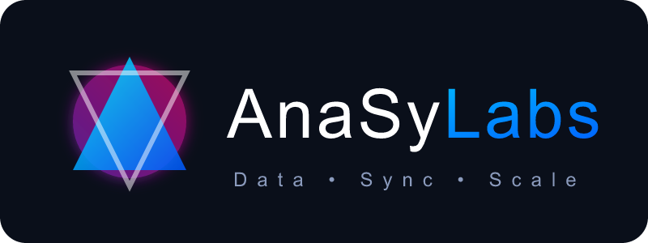

<p align="center">
  
</p>

# ANASy

Analytics Sync. Keep OLTP thin: publish fat events once to Kafka. Any number of sinks consume them.

```
OLTP  --EventPublisher-->  Kafka  --group A-->  ClickHouse
                           └────  --group B-->  DuckDB
                                    viewer  (look up event_id)
```

Kafka is the product boundary. ClickHouse and DuckDB are reference sinks, not the architecture.

## Modules

| Module | Layer |
|---|---|
| `event-connector-starter` | Core. Inject `EventPublisher`. |
| `examples/starter-example` | Sample OLTP app. Copy this pom. |
| `sinks/clickhouse-batch-sink` | Optional. Batch JDBC into ClickHouse. |
| `sinks/duckdb-batch-sink` | Optional. Upsert into a DuckDB file. |
| `viewer/` | Demo dashboard. Where is this event. |

Java 21, Spring Boot 3.4, Maven. Group `io.anasy`. Viewer is Next.js.

## Docs

| Doc | Read when |
|---|---|
| [docs/PLAN.md](docs/PLAN.md) | Locked decisions |
| [docs/hld.md](docs/hld.md) | Architecture, fan-out |
| [docs/lld.md](docs/lld.md) | Starter, publisher, how to add a sink |
| [docs/scaling.md](docs/scaling.md) | Partitions, groups, per-sink tuning |
| [docs/medallion.md](docs/medallion.md) | Bronze now; silver/gold when a query is hot |
| [docs/sinks/clickhouse.md](docs/sinks/clickhouse.md) | ClickHouse config, schema, queries |
| [docs/sinks/duckdb.md](docs/sinks/duckdb.md) | DuckDB file store, PK upsert |
| [AGENTS.md](AGENTS.md) | Agent rules |

## Quick path

Full stack (Kafka, ClickHouse, both sinks, sample OLTP, viewer):

```bash
docker compose -f examples/docker-compose.yml up --build
```

Open [http://localhost:3000](http://localhost:3000). Publish from the viewer, or:

```bash
curl -s -X POST http://localhost:8080/orders \
  -H 'Content-Type: application/json' \
  -d '{"customerName":"Ada","totalAmount":42.5}'
```

Host-only Kafka (no warehouses): `docker compose up -d` at the repo root.

OLTP usage — persist, then publish. `publishAndWait` when the caller must see the broker ack:

```java
events.publish("orders.events", order.id().toString(), fatEvent);
```
