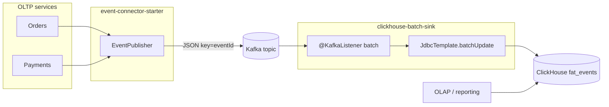
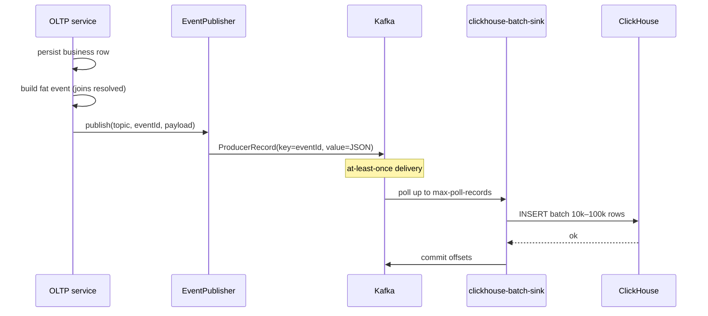
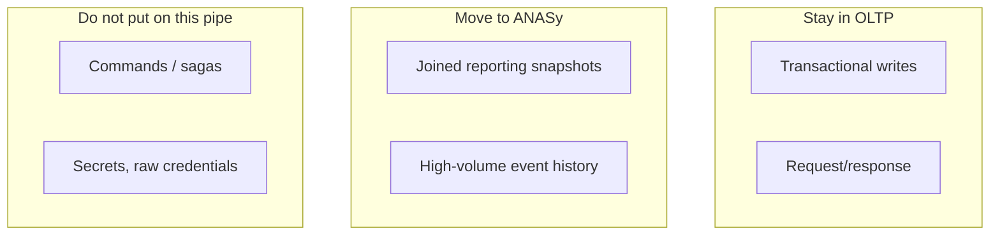

# ANASy high-level design

ANASy (Analytics Sync) offloads fat analytical events from OLTP services onto Kafka, then batch-inserts them into ClickHouse. OLTP stays a write path. Reporting reads ClickHouse.

Decisions: [PLAN.md](PLAN.md). Implementation: [lld.md](lld.md). Operations: [scaling.md](scaling.md).

## Problem

OLTP services that join five tables to serve a dashboard become slow and coupled to reporting. Fat events — the business row plus every join reporting needs — belong on an OLAP sink, not in the request path.

ANASy is that pipe. It is not a general event bus, not a CDC tool, and not a query layer.

## Containers

| Container | What it does | What it does not do |
|---|---|---|
| `event-connector-starter` | One bean: serialize and send | Retry beyond Kafka producer retries, schema validation, outbox |
| Kafka | Durable buffer, replay, fan-out | Transform payloads |
| `clickhouse-batch-sink` | Poll batches, insert rows, commit offsets | Parse JSON into columns, serve queries |
| ClickHouse `fat_events` | Store raw JSON, collapse duplicate `event_id`s | Act as the OLTP source of truth |

## Sequence

If the insert throws, the listener does not return, offsets are not committed, and Kafka redelivers. `ReplacingMergeTree` collapses the duplicate `event_id`.

## Fat event contract

The value is the fat JSON as the service already built it. ANASy does not wrap it.

| Kafka field | Source | Stored as |
|---|---|---|
| Key | Producer `eventId` (UUID string) | `event_id UUID` |
| Timestamp | Producer `CreateTime` | `event_ts DateTime`, `event_date Date` |
| Topic / partition / offset | Broker | `topic`, `kafka_partition`, `kafka_offset` |
| Value | Fat JSON | `payload String` |
| — | Sink clock | `ingested_at DateTime` (version column) |

Producer generates `eventId` before `send`. The sink never calls `UUID.randomUUID()`.

## Trust and failure

| Boundary | Rule |
|---|---|
| OLTP → Kafka | Fire-and-forget with a failure callback. A send failure is logged; it is not silently dropped. |
| Kafka → sink | At-least-once. Batch ack only after a successful insert. |
| Sink → ClickHouse | One `INSERT` per poll. Poison batches go to a DLT after bounded retries so a partition does not stall forever. |
| ClickHouse queries | Reporting uses `FINAL` or `argMax` when uniqueness matters. Background merges do the rest. |

No Kafka transactions in v1. Exactly-once across Kafka and ClickHouse is not a v1 goal.

## What lives where

## Scale sketch

Horizontal scale is Kafka partitions. One sink instance maps to one or more partitions. ClickHouse scale is batch size and part count, not more sink threads writing single rows.

Details: [scaling.md](scaling.md).

## v1 non-goals

ClickHouse Kafka table engine, Schema Registry, an outbox starter, Avro codegen, multi-tenant row filters, an admin UI.
