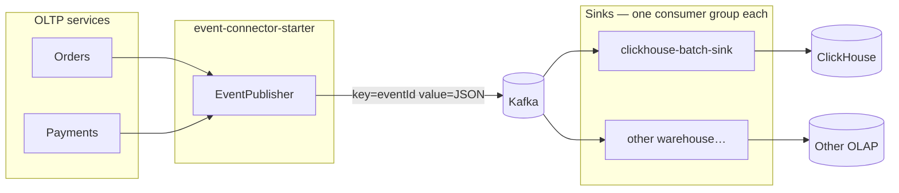
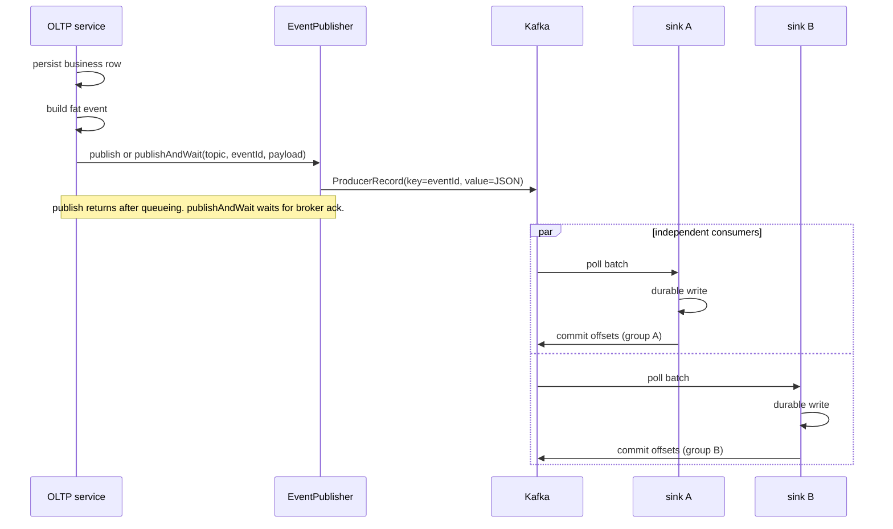
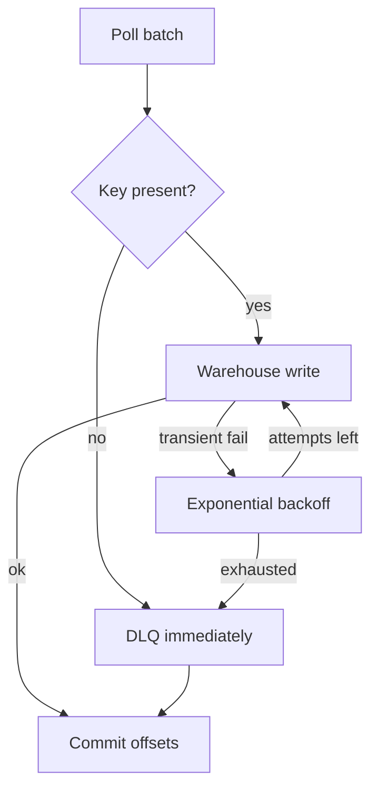
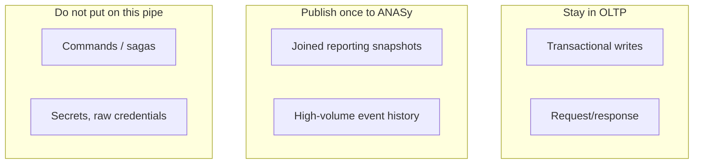

# ANASy high-level design

ANASy (Analytics Sync) offloads fat analytical events from OLTP onto Kafka. Reporting systems consume from Kafka. The warehouse is not part of the core.

Decisions: [PLAN.md](PLAN.md). Core implementation: [lld.md](lld.md). One warehouse: [sinks/clickhouse.md](sinks/clickhouse.md).

## Problem

OLTP services that join five tables to serve a dashboard become slow and coupled to reporting. Fat events — the business row plus every join reporting needs — belong on a bus, not in the request path.

ANASy is that pipe: a producer starter and a Kafka contract. It is not a warehouse, not CDC, and not a query layer.

## Containers

| Container | Layer | What it does | What it does not do |
|---|---|---|---|
| `event-connector-starter` | Core | Serialize and send | Know destinations |
| Kafka | Core | Buffer, replay, fan-out | Transform payloads |
| `clickhouse-batch-sink` | Sink | Batch-insert into ClickHouse | Speak for other warehouses |
| Next sink | Sink | Same contract, own `group-id` | Share a process or SPI with ClickHouse |

Two sinks on the same topic both receive every event because they use different consumer groups. That is the whole fan-out design.

## Sequence

A sink that throws does not commit. Kafka redelivers to **that group only**. Other sinks are unaffected. Dedup is per sink, keyed by `eventId`.

Transient warehouse failures retry with exponential backoff on that sink’s thread, then go to **that sink’s DLQ**. Poison records skip backoff.

## Kafka contract

This is the only schema ANASy owns. Warehouses map it however they like.

| Kafka field | Source | Meaning |
|---|---|---|
| Key | Producer `eventId` | Stable id. Idempotency key for every sink |
| Timestamp | Producer `CreateTime` | Event time |
| Topic | Caller | Stream name (`orders.events`) |
| Partition / offset | Broker | Replay / debug. Not the idempotency key |
| Value | Fat JSON | Opaque to the starter. Opaque to sinks unless they must type it |

No envelope JSON. No ClickHouse column names in the producer. Producer generates `eventId` before `send`. Sinks never call `UUID.randomUUID()`.

## Trust and failure

| Boundary | Rule |
|---|---|
| OLTP → Kafka | `publish`: fire-and-forget, log send failures. `publishAndWait`: block until broker ack, throw on failure. Neither is transactional with the DB write. |
| Kafka → each sink | At-least-once per consumer group. Batch ack only after a successful write. |
| Sink → warehouse | Transient: exponential backoff (1s × 2, cap 60s, 8 attempts), then that sink’s DLQ. |
| Poison records | Missing key / non-retryable → `{topic}.dlq.{sink}` immediately. Good rows in the same batch still write. |
| DLQ replay | Republish to the original topic with the original `eventId`. Warehouse dedup absorbs duplicates. |

No Kafka transactions in v1. Exactly-once across Kafka and a warehouse is not a core goal.

## What lives where

## Scale sketch

Horizontal scale is Kafka partitions. Each sink group scales on its own: instances × concurrency, capped by partition count. Warehouse tuning stays in that sink’s doc.

Details: [scaling.md](scaling.md).

## v1 non-goals

Sink SPI, multi-writer process, Schema Registry, outbox starter, Avro codegen, admin UI.
