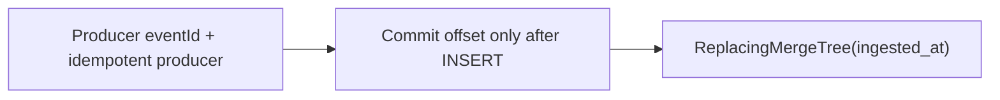

# ANASy scaling

Three knobs: Kafka partitions, ClickHouse batch size, and duplicate handling. Tune in that order.

## Kafka partitions

Consumer parallelism equals `min(sink instances × listener.concurrency, partition count)`. Extra instances sit idle.

| Topic shape | Key | Partitions |
|---|---|---|
| One event per aggregate (order placed) | Aggregate id (`eventId` = order id) | Start at 12. Raise when a sink instance is CPU- or insert-bound |
| Many events per aggregate | `eventId` UUID | Same. Ordering across events is not guaranteed |

Do not create 100 partitions “for later.” Each partition is a ClickHouse insert stream when concurrency is 1 per instance. More partitions + small polls = more tiny parts.

Raise partitions before you add sink instances. Reuse the same `group-id` (`anas-clickhouse-sink`) so the group rebalances.

Producer `enable.idempotence: true` and `acks: all` stop duplicate sends from broker retries. They do not stop duplicate *consumes*. That is ClickHouse’s job.

Fat payloads need larger fetch buffers (already in the sink YAML: `max.partition.fetch.bytes: 10MB`). If a single record exceeds that, the poll hangs — shrink the event or raise the cap.

## ClickHouse batch tuning

Each `INSERT` creates a part. Tiny parts melt the merge scheduler.

| Setting | Default in ANASy | Range |
|---|---|---|
| `spring.kafka.consumer.max-poll-records` | `10000` | Floor 1_000. Ideal 10_000–100_000 rows |
| Rows per `batchUpdate` | Same as the poll | Do not split a poll into 100-row inserts |
| Insert cadence | One insert per poll | Aim for about 1 insert/second/partition, not 1/row |
| Hikari `maximum-pool-size` | `4` | Not a throughput lever |

Fat JSON is large. 10k × 20 KB ≈ 200 MB per insert. If heap or ClickHouse insert time climbs, drop `max-poll-records` to 2_000–5_000 before you add concurrency.

Do not enable ClickHouse `async_insert` while the sink already batches to 10k. Async insert is for clients that cannot batch. If a future producer writes tiny rows directly, set `async_insert=1` and `wait_for_async_insert=1` on that user — not on the sink user.

Do not call `OPTIMIZE TABLE fat_events FINAL` from the sink. Merges run in the background.

### Parts health

```sql
SELECT
    partition,
    count() AS parts,
    sum(rows) AS rows,
    formatReadableSize(sum(bytes_on_disk)) AS size
FROM system.parts
WHERE active AND database = 'anas' AND table = 'fat_events'
GROUP BY partition
ORDER BY partition;
```

Warning: thousands of active parts, or `parts_to_throw_insert` errors. Fix by larger batches or fewer concurrent inserters, not by more sink replicas.

## Idempotency

Kafka is at-least-once. The pipeline is idempotent at three layers. All three stay.



1. **Producer.** `eventId` is the Kafka key, generated before `send`. Broker retries reuse the key. `enable.idempotence` covers produce duplicates.
2. **Sink ack.** `ack-mode: batch` + throw on insert failure. Offsets move only after ClickHouse accepts the batch.
3. **ClickHouse.** `ENGINE = ReplacingMergeTree(ingested_at) ORDER BY (topic, event_date, event_id)`. A redelivered record inserts again; the later `ingested_at` wins on merge.

The sink must not generate `event_id`. A new UUID per consume makes every retry a new row and the table grows forever.

Queries that need a unique row use `FINAL` on a narrow key or `argMax(payload, ingested_at)`. Dashboards on large ranges should tolerate pre-merge duplicates or aggregate with `argMax`.

Poison records (null key, JDBC type failure) go to `{topic}.DLT` after three retries. That is not idempotency; it is liveness. Replay a DLT record only after the payload is fixed, with the original key intact.

## What not to add when it gets busy

| Urge | Do this instead |
|---|---|
| More sink threads on one partition | More partitions, then more instances |
| Single-row inserts to “reduce latency” | Keep batches; accept poll wait (`fetch-max-wait`) |
| `ALTER TABLE UPDATE` to fix dupes | Let `ReplacingMergeTree` merge |
| ClickHouse Kafka engine beside this sink | Pick one ingest path |
| Parse JSON in the sink to “help CH” | Extract in SQL or add a materialized column |

## Capacity sketch

One sink instance, 12 partitions, 10k-record polls, 5 KB events:

- Peak poll: ~50 MB in, one insert
- Ceiling: ~12 inserts in flight if `concurrency=12` — too many parts. Keep `concurrency` at 2–4 until parts are stable, then raise.

Measure `max-poll-records` × payload size × concurrency against ClickHouse insert time and `system.parts`. That loop is the scaling process. There is no other one.
