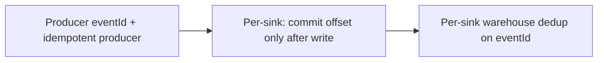

# ANASy scaling

Tune Kafka first. Then tune each sink on its own. A ClickHouse batch size is not a Snowflake batch size.

## Kafka partitions (core)

Consumer parallelism **per sink group** equals `min(instances × listener.concurrency, partition count)`. Extra instances in that group sit idle. Other groups are unaffected.

| Topic shape | Key | Partitions |
|---|---|---|
| One event per aggregate | Aggregate id (`eventId` = order id) | Start at 12. Raise when any sink is bound |
| Many events per aggregate | `eventId` UUID | Same. Ordering across events is not guaranteed |

Do not create 100 partitions “for later.” Every partition is extra fetch work for **every** sink group.

Raise partitions before you add instances. Instances in the same sink reuse that sink’s `group-id`.

Producer `enable.idempotence: true` and `acks: all` stop duplicate *sends*. They do not stop duplicate *consumes*. Each sink dedups with `eventId`.

Fat payloads need `max.partition.fetch.bytes` large enough for one record. If a record exceeds it, the poll hangs — shrink the event or raise the cap. Set this on each sink; the starter does not consume.

## Fan-out

Two warehouses ⇒ two groups, not two partitions.

```
orders.events
  group anas-sink-clickhouse
  group anas-sink-other
```

Lag is per group. ClickHouse falling behind does not block the other sink. Scale the slow group; leave the fast one alone.

## Sink-agnostic write rules

| Rule | Why |
|---|---|
| One durable write per poll | Then return so offsets commit |
| Batch if the warehouse wants batches | Do not write one row per record unless the destination is a log/blob that prefers that |
| Throw on write failure | At-least-once. Dedup handles the retry |
| Do not share a consumer group across warehouses | That load-balances, it does not replicate |

Poison records go to `{topic}.DLT` after three retries **in that sink**. Replay with the original key.

## Idempotency (core)



1. **Producer.** `eventId` is the Kafka key, generated before `send`.
2. **Each sink.** `ack-mode: batch` + throw on write failure.
3. **Each warehouse.** Upsert/replace on `eventId`. Mechanism is local (see that sink’s doc).

A sink must not generate `event_id`. A new UUID per consume makes every retry a new row in every warehouse.

## ClickHouse (this sink only)

Details: [sinks/clickhouse.md](sinks/clickhouse.md).

| Setting | Default | Range |
|---|---|---|
| `max-poll-records` | `10000` | Floor 1_000. Ideal 10_000–100_000 rows |
| Rows per `batchUpdate` | Same as the poll | Do not split into 100-row inserts |
| Hikari pool | `4` | Not a throughput lever |
| `listener.concurrency` | 1–4 | Cap by partitions; watch `system.parts` |

Each `INSERT` creates a part. Tiny parts melt merges. Do not `OPTIMIZE TABLE FINAL` from the sink. Do not turn on `async_insert` while the sink already batches.

```sql
SELECT partition, count() AS parts, sum(rows) AS rows
FROM system.parts
WHERE active AND database = 'anas' AND table = 'fat_events'
GROUP BY partition;
```

Thousands of active parts: larger batches or fewer concurrent inserters, not more replicas.

Dedup: `ReplacingMergeTree(ingested_at) ORDER BY (topic, event_date, event_id)`. Queries that need one row use `FINAL` or `argMax`.

## What not to add when it gets busy

| Urge | Do this instead |
|---|---|
| A shared sink dispatcher | Another consumer group |
| More threads on one partition | More partitions, then more instances in **that** group |
| Single-row inserts to “reduce latency” | Keep batches; raise `fetch-max-wait` if needed |
| Parse JSON in the starter to “help all sinks” | Let each warehouse extract |
| Route sink B through ClickHouse | Consume Kafka again |
